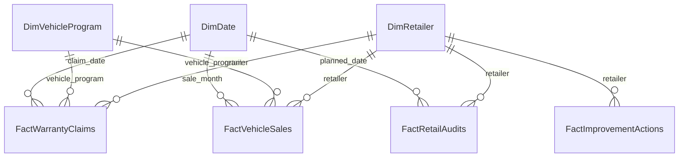
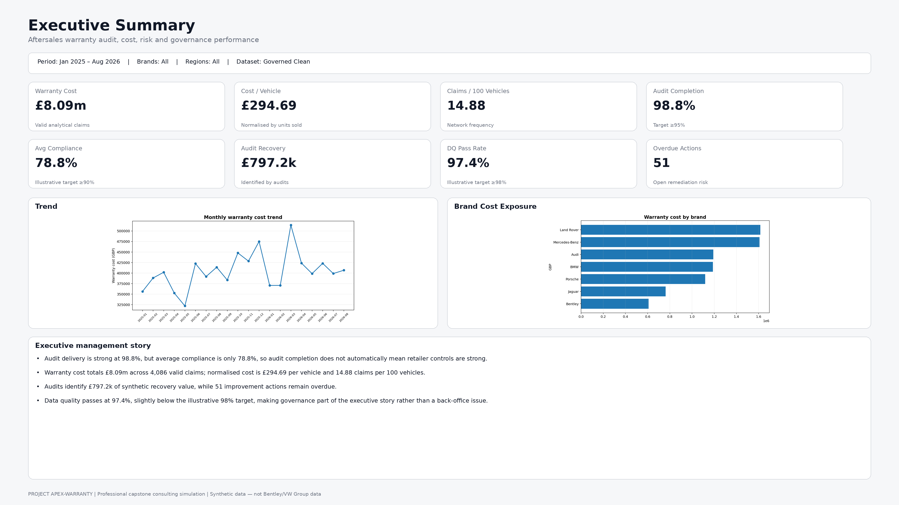
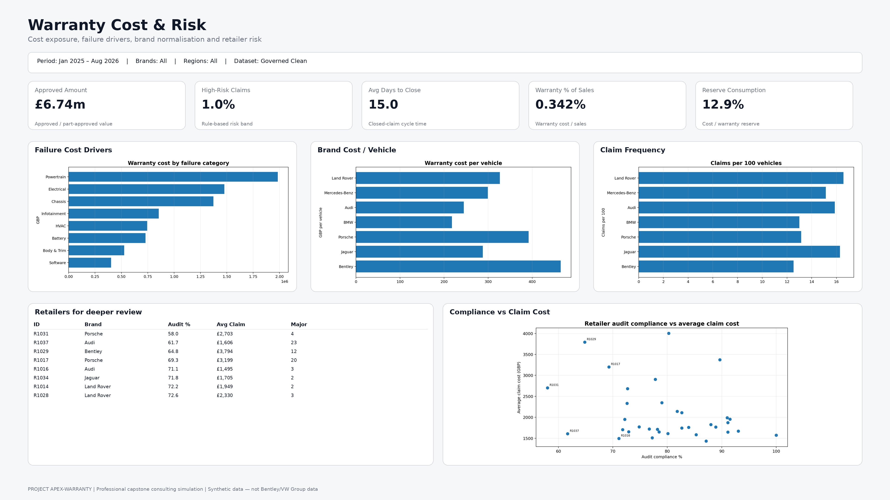
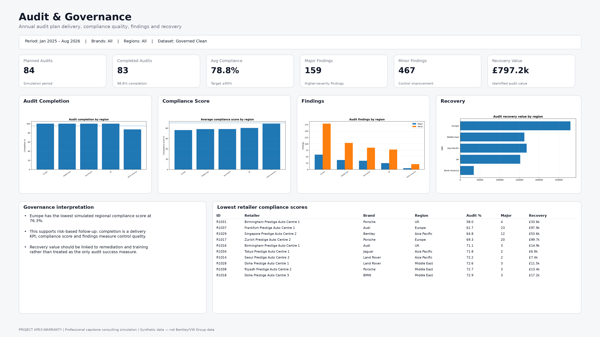
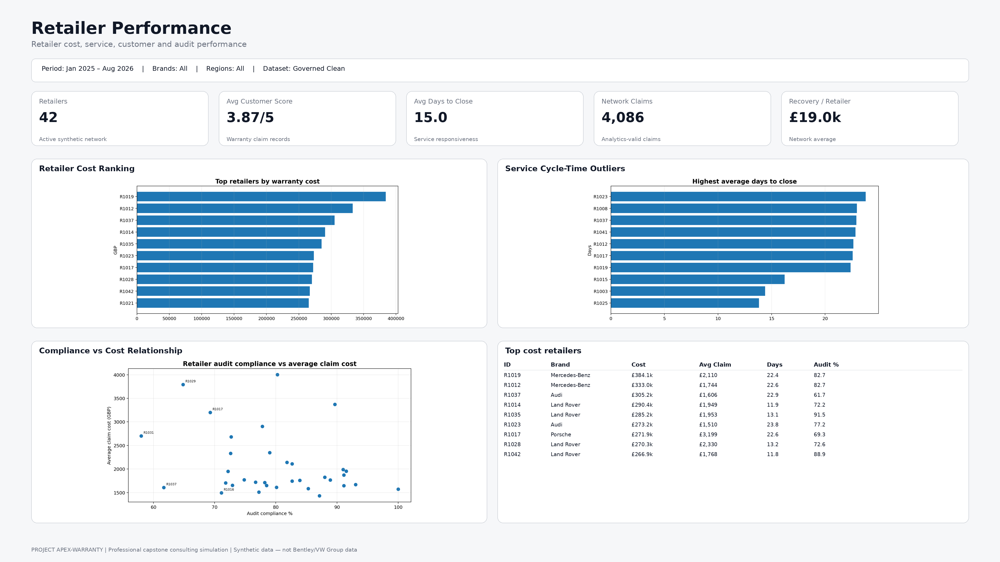
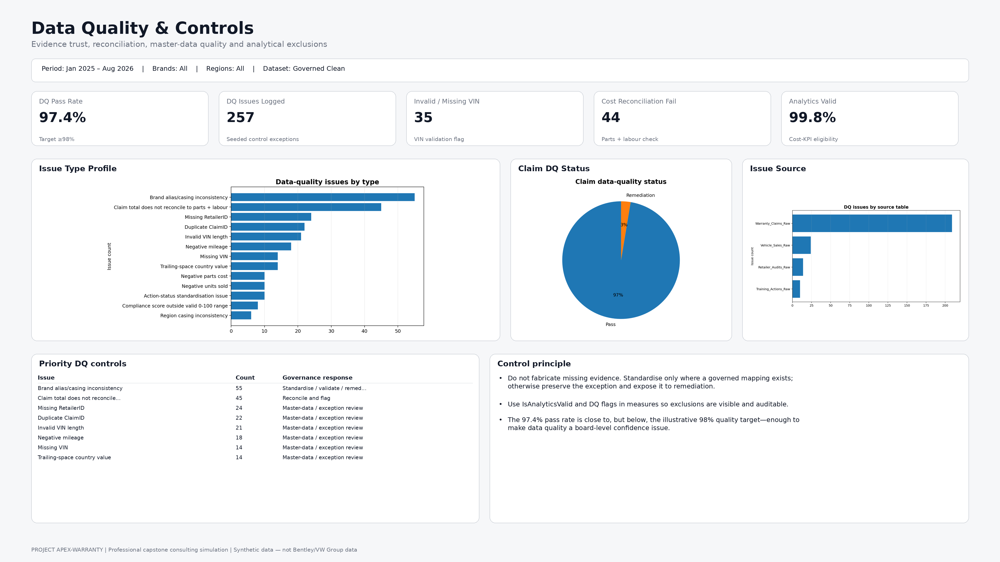
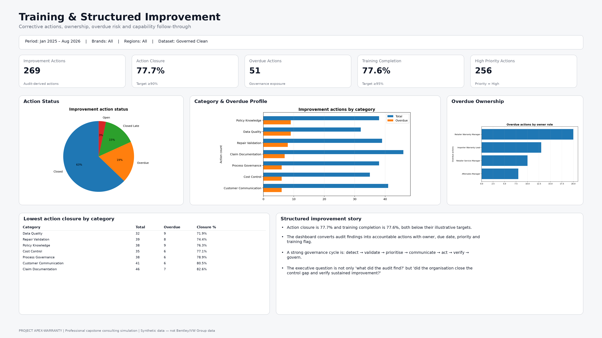

# Project APEX-WARRANTY
## Global Aftersales Warranty Audit, Governance & Performance Simulation

  
**Project type:** Professional capstone consulting simulation  
**Primary tools:** Excel, PostgreSQL/SQL, Power BI, Power Query, DAX  
**Portfolio purpose:** Demonstrate how an Aftersales Warranty Audit / Analytics function can use governed data to plan audits, analyse warranty cost risk, monitor retailer performance, communicate executive insight, and drive structured improvement.

> **Important:** This project is 100% synthetic. It does not contain confidential company's, retailer, customer, vehicle or warranty data. Automotive brand names are used only as analytical labels in a fictional multi-brand dataset.

## Business problem

A global automotive aftersales function needs a repeatable way to:

- deliver and monitor an annual retailer warranty-audit plan;
- identify warranty cost risk and vehicle-programme impacts;
- analyse claims, cost, cycle time, customer service and retailer performance;
- govern poor-quality source data before it reaches executive reporting;
- quantify audit findings and recoverable value;
- track retailer remediation, training needs and overdue actions;
- create board-level KPIs and trend reporting;
- prioritise improvement activity across regions, importers and retailers.

## Dataset

The raw workbook contains deliberately imperfect source data so the project demonstrates governance rather than only dashboard design.

| Data area | Approximate rows | Purpose |
|---|---:|---|
| Warranty claims | 4,118 raw / 4,096 deduplicated | Cost, risk, failure, service and DQ analysis |
| Vehicle sales | 840 | Normalise claims/cost against units and revenue |
| Retailer audits | 84 | Audit-plan delivery, compliance and recovery |
| Improvement actions | 269 | Remediation, training and overdue-action governance |
| Retailers | 42 | Retailer/importer/region master data |
| Vehicle programmes | 14 | Brand/model-family analysis |

## Files

- `APEXWARRANTY_D-001_Raw_Aftersales_Warranty_Audit_Data_v1.0.0.xlsx` - deliberately dirty source dataset.
- `APEXWARRANTY_D-002_Clean_Aftersales_Warranty_Audit_Data_v1.0.0.xlsx` - governed, Power BI/SQL-ready analytical dataset.
- `APEXWARRANTY_SQL-001_PostgreSQL_Analytics_Solution_v1.0.0.sql` - profiling, cleaning, star-schema logic, KPIs, risk analysis and executive queries.
- `APEXWARRANTY_G-001_Implementation_PowerBI_Interview_Guide_v1.0.0.docx` - business method, model, DAX, dashboard build and demonstration.

## Seeded data-quality problems

The raw data intentionally includes duplicates, brand aliases, missing retailer IDs, missing/invalid VINs, negative mileage, negative parts cost, claim-cost reconciliation failures, region/status inconsistencies and out-of-range audit compliance scores.

The governed cleaning approach follows a simple rule: **standardise what can be proven, recover a key only from a unique master-data match, and flag rather than invent evidence that cannot be proven.**

## Star schema

## Core KPIs

1. Audit Plan Completion %
2. Average Retailer Compliance Score %
3. Major Findings per Audit
4. Audit Recovery Value
5. Action Closure %
6. Overdue Improvement Actions
7. Training Action Completion %
8. Total Warranty Cost
9. Warranty Cost per Vehicle Sold
10. Claims per 100 Vehicles Sold
11. Warranty Cost % of Sales
12. Warranty Cost vs Reserve %
13. High-Risk Claim %
14. Average Days to Close
15. Data Quality Pass Rate %

## Synthetic validation results

These are **simulation outputs**, not market benchmarks:

- Valid warranty claims: **4,086**
- Total synthetic warranty cost: **£8,091,314.32**
- Vehicle units sold: **27,457**
- Claims per 100 vehicles: **14.88**
- Warranty cost per vehicle sold: **£294.69**
- Audit-plan completion: **98.8%**
- Average valid audit compliance score: **78.8%**
- Audit recovery value identified: **£797,249.97**
- Data-quality pass rate: **97.4%**
- Action closure rate: **77.7%**
- Overdue actions: **51**
- Training-action completion: **77.6%**
- Largest warranty-cost brand in this synthetic dataset: **Land Rover (£1,615,720.64)**
- Highest-cost failure category: **Powertrain (£1,983,913.45)**
- Lowest average audit-score region in the simulation: **Europe (76.3%)**

## Recommended Power BI pages

1. **Executive Summary** - audit delivery, compliance, warranty cost, reserve, recovery, high-risk claims and overdue actions.
2. **Warranty Cost & Risk** - brand, vehicle programme, failure category, retailer risk, claim outliers and trends.
3. **Audit & Governance** - annual plan, regional compliance, findings, recovery value and audit status.
4. **Retailer Performance** - retailer ranking, service cycle time, claims frequency, customer score and audit performance.
5. **Data Quality & Controls** - DQ pass rate, invalid VINs, cost reconciliation, excluded analytical records and issue trends.
6. **Training & Structured Improvement** - actions, overdue items, training needs, owners, priorities and closure performance.

## Power BI Dashboard Portfolio

### Executive Summary

### Warranty Cost & Risk

### Audit & Governance

### Retailer Performance

### Data Quality & Controls

### Training & Structured Improvement

## Portfolio wording

> **Project APEX-WARRANTY - Professional Capstone Consulting Simulation:** Was Designed as synthetic multi-brand automotive aftersales warranty audit and analytics solution integrating 4,000+ warranty claims, retailer audits, vehicle sales and remediation actions. Applied data-quality governance, PostgreSQL risk and KPI analysis, and a Power BI-ready star schema to demonstrate warranty cost optimisation, audit-plan monitoring, retailer performance and executive decision support.
